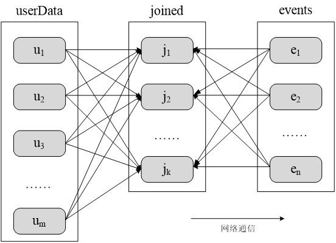

# RDD 编程

## 基础

### RDD 创建

1. 从文件系统中加载数据创建 RDD
    - Spark 采用 `textFile()` 方法来从文件系统中加载数据创建 RDD
    - 该方法把文件的 URI 作为参数, URI可以是：
        * 本地文件系统的地址
        ```scala 
        val lines = sc.textFile("file:///home/user/files/words.txt")
        ```
        
        * 分布式文件系统 HDFS 的地址
        ```scala 
        val lines = sc.textFile("hdfs://localhost:9000/user/hadoop/words.txt")
        // or
        val lines = sc.textFile("/user/hadoop/words.txt")
        ```
    - 如果使用了本地文件系统的路径, 那么, 必须要保证在所有的 worker 节点上, 也都能够采用相同的路径访问到该文件, 比如, 可以把该文件拷贝到每个 worker 节点上, 或者也可以使用网络挂载共享文件系统。
    - `textFile()` 方法的输入参数可以是文件名也可以是目录, 也可以是压缩文件等。如 `textFile("/my/dir")`, `textFile("/my/dir/*.txt")`, `textFile("/my/dir/*.gz")`.
    - `textFile()` 方法也可以接受第2个输入参数(可选), 用来指定分区的数目。默认情况下, Spark 会为 HDFS 的每个 block 创建一个分区(HDFS 中每个 block 默认是 128 MB)。也可以提供一个比 block 数量更大的值作为分区数目, 但是不能提供一个小于 block 数量的值作为分区数目。
2. 通过并行集合（数组）创建 RDD
    ```scala 
    // 可调用 SparkContext 的 parallelize 方法, 
    // 在 Driver 中一个已经存在的集合（数组）上创建
    val arr = Array(1, 2, 3, 4, 5)
    val rdd = sc.parallelize(arr)

    val list = List(1, 2, 3, 4, 5)
    val rdd = sc.parallelize(list)
    ```
    

### RDD 操作

#### 转换操作

- 对于 RDD 而言, 每一次转换操作都会产生不同的 RDD, 供给下一个转换使用.
- 转换得到的 RDD 是惰性求值的, 即整个转换过程只是记录了转换的轨迹, 并不会发生真正的计算, 只有遇到行动操作时, 才会发生真正的计算, 开始从血缘关系源头开始, 进行物理的转换操作.

常用的 RDD 转换操作 API:

| Method              | Description                                                                                                               |
|---------------------|---------------------------------------------------------------------------------------------------------------------------|
| `filter(func)`      | 筛选出满足函数 func 的元素, 并返回一个新的数据集                                                                          |
| `map(func)`         | 将每个元素传递到函数func中, 并将结果返回为一个新的数据集                                                                  |
| `flatMap(func)`     | 与 `map()` 相似, 但每个输入元素都可以映射到 0 或多个输出结果                                                              |
| `groupByKey()`      | 应用于 (K,V) 键值对的数据集时, 返回一个新的 (K,Iterable) 形式的数据集                                                     |
| `reduceByKey(func)` | 应用于 (K,V) 键值对的数据集时, 返回一个新的 (K,V) 形式的数据集, 其中每个值是将每个 key 传递到函数 func 中进行聚合后的结果 |

##### filter(func)

```scala 
val lines = sc.textFile("file:///usr/local/spark/mycode/rdd/word.txt")
val linesWithSpark = lines.filter(
    line => line.contains("Spark")
)
```


##### map(func)

```scala 
val data = Array(1, 2, 3, 4, 5)
val rdd1 = sc.parallelize(data)
val rdd2 = rdd1.map(x => x + 10)
```


```scala 
val lines = sc.textFile("file:///usr/local/spark/mycode/rdd/word.txt")
val words = lines.map(
    line => line.split(" ")
)
```


##### flatMap(func)

```scala 
val lines = sc.textFile("file:///usr/local/spark/mycode/rdd/word.txt")
val words = lines.flatMap(line => line.split(" "))
```


##### groupByKey()


##### reduceByKey()


#### 行动操作

行动操作是真正触发计算的地方。Spark 程序执行到行动操作时, 才会执行真正的计算, 从文件中加载数据, 完成一次又一次转换操作, 最终, 完成行动操作得到结果。

常用的 RDD 行动操作 API:

| Method          | Description                                                 |
|-----------------|-------------------------------------------------------------|
| `count()`       | 返回数据集中的元素个数                                      |
| `collect()`     | 以数组的形式返回数据集中的所有元素                          |
| `first()`       | 返回数据集中的第一个元素                                    |
| `take(n)`       | 以数组的形式返回数据集中的前 n 个元素                       |
| `reduce(func)`  | 通过函数 func（输入两个参数并返回一个值）聚合数据集中的元素 |
| `foreach(func)` | 将数据集中的每个元素传递到函数 func 中运行                  |

```scala
val rdd = sc.parallelize(Array(1, 2, 3, 4, 5))
// rdd: org.apache.spark.rdd.RDD[Int]=ParallelCollectionRDD[1] at parallelize
rdd.count()
// res0: Long = 5
rdd.first()
// res1: Int = 1
rdd.take(3)
// res2: Array[Int] = Array(1,2,3)
rdd.reduce((a,b)=>a+b)
// res3: Int = 15
rdd.collect()
// res4: Array[Int] = Array(1,2,3,4,5)
rdd.foreach(elem => println(elem))
//1
//2
//3
//4
//5
```

#### 惰性机制

所谓的惰性机制是指, 整个转换过程只是记录了转换的轨迹, 并不会发生真正的计算, 只有遇到行动操作时, 才会触发从头到尾的真正的计算.

```scala 
val lines = sc.textFile("data.txt")
val lineLengths = lines.map(s => s.length)
val totalLength = lineLengths.reduce((a, b) => a + b)
```

### RDD 持久化

在 Spark 中, RDD 采用惰性求值的机制, 每次遇到行动操作, 都会从头开始执行计算。每次调用行动操作, 都会触发一次从头开始的计算。这对于迭代计算而言, 代价是很大的, 迭代计算经常需要多次重复使用同一组数据.

下面就是多次计算同一个 RDD 的例子：

```scala 
val list = List("Hadoop","Spark","Hive")
// list: List[String] = List(Hadoop, Spark, Hive)
val rdd = sc.parallelize(list)
// rdd: org.apache.spark.rdd.RDD[String] = ParallelCollectionRDD[22] at  parallelize
println(rdd.count()) // 行动操作, 触发一次真正从头到尾的计算
// 3
println(rdd.collect().mkString(",")) // 行动操作, 触发一次真正从头到尾的计算
// Hadoop,Spark,Hive
```

- 可通过持久化（缓存）机制避免这种重复计算的开销.
- 可以使用 `persist()` 方法对一个 RDD 标记为持久化.
- 之所以说标记为持久化, 是因为出现 `persist()` 语句的地方, 并不会马上计算生成 RDD 并把它持久化, 而是要等到遇到第一个行动操作触发真正计算以后, 才会把计算结果进行持久化.
- 持久化后的 RDD 将会被保留在计算节点的内存中被后面的行动操作重复使用.

`persist()` 的圆括号中包含的是持久化级别参数：
- `persist(MEMORY_ONLY)`：表示将 RDD 作为反序列化的 JAVA 对象存储于 JVM 中, 若内存不足, 就要按照 LRU(Least Recently Used) 原则替换缓存中的内容, 部分数据分区将不再缓存, 在每次需要用到这些数据时重新进行计算.
- `persist(MEMORY_AND_DISK)`: 表示将 RDD 作为反序列化的 JAVA 对象存储在 JVM 中, 如内存不足, 超出的分区会存放在硬盘上,需要时从硬盘读取.
- `MEMORY_ONLY_SER`: 将 RDD 以序列化的 Java 对象的形式进行存储(每个分区为一个 byte 数组)。这种方式会比反序列化对象的方式节省很多空间, 但在读取时会增加 CPU 计算负担.
- `MEMORY_AND_DISK_SER`: 类似于 `MEMORY_ONLY_SER`, 但溢出的分区会
存储到磁盘, 而不是在用到它们时重新计算。
- `DISK_ONLY`: 只在磁盘上缓存 RDD。
- 一般而言, 使用 `cache()` 方法时, 会调用 `persist(MEMORY_ONLY)`.
- 可用 `unpersist()` 方法手动地把持久化的 RDD 从缓存中移除.

针对上面的实例, 增加持久化语句以后的执行过程如下:

```scala 
val list = List("Hadoop","Spark","Hive")
// list: List[String] = List(Hadoop, Spark, Hive)
val rdd = sc.parallelize(list)
// rdd: org.apache.spark.rdd.RDD[String] = ParallelCollectionRDD[22] at parallelize
rdd.cache() // 会调用 persist(MEMORY_ONLY), 但语句执行到这里, 并不会缓存rdd, 因为这时rdd还没有被计算生成
println(rdd.count()) // 第一次行动操作, 触发一次真正从头到尾的计算, 这时上面的rdd.cache()才会被执行, 把这个rdd放到缓存中
// 3
println(rdd.collect().mkString(",")) //第二次行动操作, 不需要触发从头到尾的计算, 只需要重复使用上面缓存中的rdd
// Hadoop,Spark,Hive
```

### RDD 分区

- RDD 是弹性分布式数据集, 是一个只读的、分区的记录集合。通常 RDD 很大, 会被分成很多个分区, 不同的分区分别保存在不同的节点上.
- 分区是 spark 在内存中进行并行计算时的一块独立的空间, 是 RDD 并行计算的最小单元, 每个分区的数值计算都是在一个任务中进行的.


- 分区过少：将无法充分利用群集中的所有可用的 CPU core.
- 分区过多：产生非常多的小任务, 从而会产生过多的开销.
- 数据源为 HDFS 时, RDD 的分区数一般由 HDFS 的 Block 数决定.
- 结果集的数据量减少时, 其对应的分区数也应当相应地减少.
- 一般合理的分区数设置为集群总核数的 2~3 倍.
- 分区数决定了将 RDD 保存到文件的操作生成的文件数.

#### 分区的作用

1. 增加并行度
2. 减少通信开销

> UserData(UserId, UserInfo): 用户信息表, 大数据表.  
> Events(UserId, LinkInfo)：用户订阅主题信息表, 相对小的数据表.  
> UserData 和Events 表进行连接操作, 获得 (UserId, UserInfo, LinkInfo).

第 1 个表是一个很大的用户信息表 UserData(UserId, UserInfo),其中 UserId 和 UserInfo 是 UserData 表的两个字段, UserInfo 包含了某个用户所订阅的主题信息。

第 2 个表是 Events (UserId, LinkInfo), 这个表比较小, 只记录了过去五分钟内发生的事件, 即某个用户查看了哪个链接。

连接(Join)是查询分析中常发生的一种操作, 为了对用户访问情况进行统计, 需周期性地对 UserData 和 Events 这两个表进行连接操作 , 获得 (UserId, UserInfo, LinkInfo) 这种形式的结果, 从而知道某个用户订阅的是哪个主题, 及访问了哪个链接。

在执行 Spark 作业时, UserData 表会被加载到内存中, 生成 RDD（假设 RDD的名称为 userData）, RDD 中的每个元素是(UserId,  UserInfo）这种形式的键值对, 即 key 是 UserId, value 是 UserInfo.
Events 表也会被加载到内存中生成 RDD (假设名称为 events ), RDD 中的每个元素是 (UserId,  LinkInfo) 这种形式的键值对 ,  key 是Userld, value 是 LinkInfo.

由于 UserData 是一个很大的表, 通常会被存放到 HDFS 文件中, Spark 会根据每个 RDD 元素的数据来源, 把每个 RDD 元素放在相应的节点上。例如, 从工作节点 u1 上的 HDFS 文件块中读取到的记录, 其生成的RDD元素((Userld, Userlnfo)形式的键值对), 就会被放在节点 u1 上, 节点 u2 上的 HDFS 文件块中读取到的记录, 其生成的 RDD 元素会被放在 u2 上, 最终 userData 这个 RDD 的元素就会分布在 u1,u2,…,um 上。

然后, 执行连接操作userData join(events)得到连接结果。默认情况下, 连接操作会将两个数据集中的所有的 key 的哈希值都求出来, 将哈希值相同的记录传送到同一台机器上, 之后在该机器上对所有 key 相同的记录进行连接操作.

例如, 对 userData 这个RDD 而言, 它在节点 u1 上的所有RDD 元素, 就需要根据 key 的值进行哈希, 然后, 根据哈希值再分发到 u1, u2,…,uk 这些节点上：在节点 u2 上的所有 RDD 元素, 也需要根据 key 的值进行哈希, 然后根据哈希值再分发到 u1, u2, …, uk 这些节点上；同理, 其他节点上的 RDD 元素, 都需进行同样操作.

对于 event 这个RDD 而言, 也需执行同样的操作。可以看出, 在这种情況下, 每次进行连接操作都会有数据混洗的问题, 造成很大的网络传输开销.

未分区时对 UserData 和 Events 两个表进行连接操作:



实际上, 由于 userData 这个 RDD 要比 events 大很多, 故可选择对 userData 进行分区。可以采用哈希分区方法, 把 userData 这个 RDD 分区
成 m 个分区, 分布在节点 u1, u2, …, um 上。对 userData 进行分区以后, 在执行连接操作时, 就不会产生数据混洗情况.

由于已对 userData 根据哈希值进行了分区, 在执行连接操作时, 不需要再把 userData 中的每个元素进行哈希求值后分发到其他节点上, 只需对 events 这个RDD 的每个元素求哈希值(采用和 userData 同样的哈希函数), 根据哈希值把 events 中的 RDD 元素分发到对应的 u1, u2, …, um 上.
整个过程中, 只有 events 发生了数据混洗, 产生网络通信, 而 userData
的数据在本地引用, 不会产生网络传输开销.
Spark 通过数据分区,  对于一些特定类型的操作（如 join 、groupByKey、reduceByKey、combineByKey、lookup等）, 可以大大降低网络传输开销.

采用分区以后对UserData和Events两个表进行连接操作:


#### RDD 分区原则

RDD 分区的一个原则是使得分区的个数尽量等于集群中的 CPU 核心(core)数目.

对于不同的 Spark 部署模式而言（本地模式、Standalone模式、YARN模式、Mesos模式）, 都可以通过设置 `spark.default.parallelism` 这个参数的值来配置默认的分区数目, 一般而言：
- 本地模式：默认为本地机器的 CPU 数目, 若设置了 `local[N]`, 则默认为`N`.
- Apache Mesos：默认的分区数为 8.
- Standalone 或 YARN：在`集群中所有 CPU 核心数目总和` 和 `2` 二者中取较大值作为默认值.

#### 设置分区的个数

- 创建 RDD 时手动指定分区个数
    * 在调用 `textFile()` 和 `parallelize()` 方法的时候手动指定分区个数即可, 语法格式如下：`sc.textFile(path, partitionNum)`.
    * 其中, path 参数用于指定要加载的文件的地址, partitionNum 参数用于指定分区个数.
    ```scala 
    val lines = sc.textFile("data.txt", 2) // 设置两个分区

    val arr = Array(1, 2, 3, 4, 5)
    val rdd = sc.parallelize(arr, 2) // 设置两个分区
    ```
- 使用 `reparititon` 方法重新设置分区个数. repartition(partitionNums)： Reshuffle the data in the RDD randomly to create either more or fewer partitions and balance it across them. This always shuffles all data over the network.

    
    ```scala 
    val data = sc.textFile("file:///usr/local/spark/mycode/rdd/word.txt",2)
    // data: org.apache.spark.rdd.RDD[String] = file:///usr/local/spark/mycode/rdd/word.txt MapPartitionsRDD[12]
    data.partitions.size // 显示data这个RDD的分区数量
    // res2: Int=2
    val rdd = data.repartition(1) // 对data这个RDD进行重新分区
    // rdd: org.apache.spark.rdd.RDD[String] = MapPartitionsRDD[11]
    rdd.partitions.size
    // res4: Int = 1
    ```

#### 自定义分区方法

Spark 提供了自带的 HashPartitioner(哈希分区) 与 RangePartitioner(区域分区), 能够满足大多数应用场景的需求。同时 Spark 也支持自定义分区方式, 即通过一个自定义的 Partitioner 对象来控制 RDD 的分区方式, 从而利用领域知识进一步减少通信开销.

```scala 
val list = List((1, 'a'), (1, 'aa'), (2, 'b'), (2, 'bb'), (3, 'c'))
val rdd = sc.parallelize(list, 3)
val counts = rdd.partitionBy(new HashPartitioner(3))
// HashPartitioner 确定分区的方式：
// partition = key.hashCode () % numPartitions.

// HashPartitioner 分区可能导致每个分区中的数据量不均匀.

val list = List((1, 'a'), (1, 'aa'), (2, 'b'), (2, 'bb'), (3, 'c'))
val rdd = sc.parallelize(list, 3)
val counts = rdd.partitionBy((new RangePartitioner(3, counts))
// RangePartitioner确定分区的方式：
// 对 key 值进行排序, 然后将 key 值划分成 3 份 key 值集合

// RangePartitioner 分区尽量保证每个分区中数据量的均匀, 
// 将一定范围内的数映射到某一个分区内。分区与分区之间数据是有序的, 
// 但分区内的元素是不能保证顺序的
```

要实现自定义分区, 需要定义一个类, 这个自定义类需要继承 `org.apache.spark.Partitioner` 类, 并实现下面三个方法：
- `numPartitions`: 返回创建出来的分区数.
- `getPartition(key: Any)`: 返回给定键的分区编号(`0`到`numPartitions-1`)
- `equals()`: Java 判断相等性的标准方法

实例：根据 key 值的最后一位数字, 写到不同的文件.

如：
- 10写入到part-00000
- 11写入到part-00001
- ...
- 19写入到part-00009

```scala 
import org.apache.spark.{Partitioner, SparkContext, SparkConf}

// 自定义分区类, 需继承 org.apache.spark.Partitioner 类
class MyPartitioner(numParts : Int) extends Partitioner{
    // 覆盖分区数
    override def numPartitions : Int = numParts

    //覆盖分区号获取函数
    override def getPartition(key : Any) : Int = {
        key.toString.toInt % 10
    }
}

object TestPartitioner {
    def main(args : Array[String]) {
        val conf = new SparkConf()
        val sc = new SparkContext(conf)

        // 模拟5个分区的数据
        val data = sc.parallelize(1 to 10, 5)
        // 根据尾号转变为 10 个分区
        data.map(
            (_, 1)
        ).partitionBy(
            new MyPartitioner(10)
        ).map(
        _._1
        ).saveAsTextFile(
            "file:///usr/local/spark/mycode/rdd/partitioner"
        )
    }
} 
```

### Demo

假设有一本地文件 word.txt, 里面包含了很多行文本, 每行文本由多个单词构成, 单词之间用空格分隔。可以使用如下语句进行词频统计（即统计每个单词出现的次数）:

```scala
val lines = sc.textFile("file:///usr/local/spark/mycode/wordcount/word.txt")
val wordCount = lines.flatMap(
    line => line.split(" ")
).map(
    word => (word, 1)
).reduceByKey(
    (a, b) => a + b
)
wordCount.collect()
wordCount.foreach(println)
```


在实际应用中, 单词文件可能非常大, 会被保存到分布式文件系统 HDFS 中, Spark 和 Hadoop 会统一部署在一个集群上, Spark 可以就近处理部署在一起的 HDFS 节点中的数据.

在一个集群中同时部署 Hadoop 和 Spark:


词频统计程序, 分布式运行在每个 salve 节点的每个分区上, 统计本分区里的单词计数, 然后传回 driver, 再由 driver 合并来自各个分区的所有单词计数, 形成最终的单词计数。


## 键值对 RDD(pair RDD)

### 键值对 RDD 的创建

- 从文件中加载
    ```scala 
    val lines = sc.textFile("file:///usr/local/spark/mycode/pairrdd/word.txt")
    // lines: org.apache.spark.rdd.RDD[String] = file:///usr/local/spark/mycode/pairrdd/word.txt MapPartitionsRDD[1]
    val pairRDD = lines.flatMap(
        line => line.split(" ")
    ).map(
        word => (word,1)
    )
    // pairRDD: org.apache.spark.rdd.RDD[(String, Int)] = MapPartitionsRDD[3]
    pairRDD.foreach(println)
    // (i,1)
    // (love,1)
    // (hadoop,1)
    // ...
    ```
- 通过并行集合(数组)创建 RDD
    ```scala 
    val list = List("Hadoop","Spark","Hive","Spark")
    // list: List[String] = List(Hadoop, Spark, Hive, Spark)
    val rdd = sc.parallelize(list)
    // rdd: org.apache.spark.rdd.RDD[String] = ParallelCollectionRDD[11] at parallelize
    val pairRDD = rdd.map(word => (word,1))
    // pairRDD: org.apache.spark.rdd.RDD[(String, Int)] = MapPartitionsRDD[12] at 
    pairRDD.foreach(println)
    // (Hadoop,1)
    // (Spark,1)
    // (Hive,1)
    // (Spark,1)
    ```

### 常用的键值对 RDD 转换操作

- reduceByKey(func)
- groupByKey()
- keys
- values
- sortByKey()
- mapValues(func)
- join
- combineByKey

#### reduceByKey(func)

```scala 
// 使用func函数合并具有相同键的值
// (Hadoop,1)
// (Spark,1)
// (Hive,1)
// (Spark,1)
pairRDD.reduceByKey((a, b) => a + b).foreach(println)
// (Spark,2)
// (Hive,1)
// (Hadoop,1)
```

#### groupByKey()

```scala 
// 对具有相同键的值进行分组
// 如对四个键值对
// ("spark",1)
// ("spark",2)
// ("hadoop",3)
// ("hadoop",5), 
// 采用 groupByKey() 后得到的结果是：
// ("spark",(1,2))
// ("hadoop",(3,5))
```

reduceByKey 和 groupByKey 的区别:
- reduceByKey 用于对每个 key 对应的多个 value 进行 merge 操作, 最重要的是它能够在本地先进行 merge 操作, 并且 merge 操作可以通过函数自定义.
- groupByKey 也是对每个 key 进行操作, 但只生成一个 sequence, groupByKey 本身不能自定义函数, 需要先用 groupByKey 生成 RDD, 然后才能对此 RDD 通过 map 进行自定义函数操作.

```scala 
val words = Array("one", "two", "two", "three", "three", "three")
val wordPairsRDD = sc.parallelize(words).map(
    word => (word, 1)
)

val wordCountsWithReduce = wordPairsRDD.reduceByKey(_ + _)
val wordCountsWithGroup = wordPairsRDD.groupByKey().map(
    t => (t._1, t._2.sum)
)
// 上面得到的 wordCountsWithReduce 和 wordCountsWithGroup 是完全一样的, 但它们的内部运算过程是不同的
```
#### keys()

把 Pair RDD 中的 key 返回形成一个新的 RDD

```scala 
// (Hadoop,1)
// (Spark,1)
// (Hive,1)
// (Spark,1)
pairRDD.keys.foreach(println)
// Hadoop
// Spark
// Hive
// Spark
```

#### values()

把 Pair RDD 中的 value 返回形成一个新的 RDD.

```scala 
// (Hadoop,1)
// (Spark,1)
// (Hive,1)
// (Spark,1)
pairRDD.values.foreach(println)
// 1
// 1
// 1
// 1
```

#### sortByKey()

返回一个根据键排序的 RDD.

```scala 
// (Hadoop,1)
// (Spark,1)
// (Hive,1)
// (Spark,1)
pairRDD.sortByKey().foreach(println)
// (Hadoop,1)
// (Hive,1)
// (Spark,1)
// (Spark,1)
```

`sortByKey()` 和 `sortBy()` ：sortBy 是对标准的 RDD 进行排序, sortByKey 是对 PairRDD 进行排序.

```scala 
def sortByKey(ascending : Boolean = true,
    numPartitions : Int = self.partitions.size
) : RDD[(K, V)]

def sortBy[K](f: (T) => K,
    ascending : Boolean = true,
    numPartitions : Int = this.partitions.size
) : RDD[T]
/*
 * 第一个参数是一个函数, 带有一个带T泛型的参数, 返回类型和RDD中元素的类型是一致的
 * 第二个参数是ascending, 决定排序后RDD中的元素是升序还是降序, 默认是true, 也就是升序
 * 第三个参数是numPartitions, 该参数决定排序后的RDD的分区个数, 
 默认排序后的分区个数和排序之前的个数相等, 即为this.partitions.size
 */
```

```scala 
val d1 = sc.parallelize(
    Array(
        ("c", 8), ("b", 25), ("c", 17),
        ("a", 42), ("b", 4), ("d", 9),
        ("e", 17), ("c", 2), ("f", 29),
        ("g", 21), ("b", 9)
    )
) 

d1.reduceByKey(_ + _).sortByKey(false).collect
// res2: Array[(String, Int)] = Array((g,21),(f,29),(e,17),(d,9),(c,27),(b,38),(a,42)) 

val d2 = sc.parallelize(
    Array(
        ("c", 8), ("b", 25), ("c", 17),
        ("a", 42), ("b", 4), ("d", 9),
        ("e", 17), ("c", 2), ("f", 29),
        ("g", 21), ("b", 9)
    )
)
d2.reduceByKey(_ + _).sortBy(_._2, false).collect
// res4: Array[(String, Int)] = Array((a,42),(b,38),(f,29),(c,27),(g,21),(e,17),(d,9))
```

#### mapValues(func)

对键值对 RDD 中的每个 value 都应用一个函数, 但是 key 不会发生变化.

```scala
// (Hadoop,1)
// (Spark,1)
// (Hive,1)
// (Spark,1)
pairRDD.mapValues(x => x + 1).foreach(println)
// (Hadoop,2)
// (Spark,2)
// (Hive,2)
// (Spark,2)
```

#### join()

join 就表示内连接。对于内连接, 对于给定的两个输入数据集 (K, V1) 和 (K, V2), 只有在两个数据集中都存在的 key 才会被输出, 最终得到一个(K, (V1, V2)) 类型的数据集。

```scala
val pairRDD1 = sc.parallelize(
    Array(
        ("spark", 1), ("spark", 2),
        ("hadoop", 3), ("hadoop", 5)
    )
)
// pairRDD1: org.apache.spark.rdd.RDD[(String, Int)] = ParallelCollectionRDD[24]

val pairRDD2 = sc.parallelize(Array(("spark","fast")))
// pairRDD2: org.apache.spark.rdd.RDD[(String, String)] = ParallelCollectionRDD[25]

pairRDD1.join(pairRDD2)
// res9: org.apache.spark.rdd.RDD[(String, (Int, String))] = MapPartitionsRDD[28] at join
pairRDD1.join(pairRDD2).foreach(println)
// (spark,(1,fast))
// (spark,(2,fast))
```

### Demo

给定一组键值对:
- ("spark",2)
- ("hadoop",6)
- ("hadoop",4)
- ("spark",6)

键值对的 key 表示图书名称, value 表示每天图书销量, 
请计算每个键对应的平均值, 也就是计算每种图书的每天平均销量。

```scala 
val rdd = sc.parallelize(
    Array(
        ("spark", 2), ("hadoop", 6),
        ("hadoop", 4), ("spark", 6)
    )
)
// rdd: org.apache.spark.rdd.RDD[(String, Int)] = ParallelCollectionRDD[38] at parallelize
rdd.mapValues(
    x => (x, 1)
).reduceByKey(
    (x, y) => (x._1 + y._1, x._2 + y._2)
).mapValues(
    x => (x._1 / x._2)
).collect
// res22: Array[(String, Int)] = Array((spark,4), (hadoop,5))
```


```scala 
val rdd = sc.parallelize(
    Array(
        ("spark", 2), ("hadoop", 6),
        ("hadoop", 4), ("spark", 6)
    )
)

rdd.map(
    x => (x._1, (x._2, 1))
).reduceByKey(
    (x, y) => (x._1 + y._1, x._2 + y._2)
).map(
    x => (x._1, x._2._1 / x._2._1)
).collect
// res22: Array[(String, Int)] = Array((spark,4), (hadoop,5))

rdd.groupByKey().map(
    x => {
        var num = 0 
        var sum = 0
        for (i <- x._2) {
            sum = sum + i
            num = num + 1
        }

        (x._1, sum / num)
    }
).collect

rdd.groupByKey().map(
    x => {
        (x._1, x._2.sum / x._2.size)
    }
).collect
```

## 综合案例

### 求 top 值

任务描述：
orderid, userid, payment, productid

file1.txt
- 1,1768,50,155 
- 2,1218, 600,211 
- 3,2239,788,242 
- 4,3101,28,599 
- 5,4899,290,129 
- 6,3110,54,1201
- 7,4436,259,877 
- 8,2369,7890,27

file2.txt
- 100,4287,226,233 
- 101,6562,489,124 
- 102,1124,33,17 
- 103,3267,159,179 
- 104,4569,57,125
- 105,1438,37,116

求 Top N 个 payment 值.

```scala 
import org.apache.spark.{SparkConf, SparkContext}

object TopN {
    def main(args : Array[String]) : Unit = {
        val conf = new SparkConf().setAppName("TopN").setMaster("local")
        val sc = new SparkContext(conf)
        sc.setLogLevel("ERROR")

        val lines = sc.textFile("hdfs://localhost:9000/user/hadoop/spark/mycode/rdd/examples", 2)

        var num = 0
        val result = lines.filter(
            line =>
            (line.trim().length > 0) &&
            (line.split(",").length == 4)
        ).map(
            _.split(",")(2)
        ).map(
            x => (x.toInt, "")
        ).sortByKey(false).map( // 降序排序
            x => x._1
        ).take(5).foreach(
            x => {
                num = num + 1
                println(num + "\t" + x)
            }
        )
    }
}
```

### 求最大最小值

任务描述：求出多个文件中数值的最大、最小值

file1.txt
- 129
- 54
- 167
- 324
- 111
- 54
- 26
- 697
- 4856
- 3418

file2.txt
- 5
- 329
- 14
- 4567
- 2186
- 457
- 35
- 267

```scala 
import org.apache.spark.{SparkConf, SparkContext}

object MaxAndMin {
    def main(args : Array[String]) : Unit = {
        val conf = new SparkConf().setAppName("MaxAndMin").setMaster("local")
        val sc = new SparkContext(conf)
        sc.setLogLevel("ERROR")

        val lines = sc.textFile("hdfs://localhost:9000/user/hadoop/spark/mycode/rdd/examples", 2)

        val result = lines.filter(
            _.trim().length > 0
        ).map(
            line => ("key", line.trim.toInt)
        ).groupByKey().map(
            x => {
                var min = Integer.MAX_VALUE
                var max = Integer.MIN_VALUE
                for (num <- x._2) {
                    if (num > max) {
                        max = num
                    }
                    if (num < min) {
                        min = num
                    }
                }
                (max, min)
            }
        ).collect.foreach(
            x => {
                println("max\t" + x._1)
                println("min\t" + x._2)
            }
        )
        val result = lines.filter(
            _.trim().length > 0
        ).map(
            line => ("key", line.trim.toInt)
        ).groupByKey().map(
            x => {
                println("max:" + x._2.max)
                println("max:" + x._2.min)
            }
        ).collect
    }
}
```

### 文件排序

任务描述：有多个输入文件, 每个文件中的每一行内容均为一个整数。要求读取所有文件中的整数, 进行排序后, 输出到一个新的文件中, 输出的内容个数为每行两个整数, 第一个整数为第二个整数的排序位次, 第二个整数为原待排序的整数.

<details>
    <summary>输入文件</summary>
file1.txt: <br>
33 <br>
37 <br>
12 <br>
40 <br>
file2.txt: <br>
4 <br>
16 <br>
39 <br>
5 <br>
file3.txt:   <br>
1 <br>
45 <br>
25
</details>

<details>
    <summary>输出文件</summary>
1 1   <br>
2 4   <br>
3 5   <br>
4 12   <br>
5 16   <br>
6 25   <br>
7 33   <br>
8 37   <br>
9 39   <br>
10 40   <br>
11 45
</details>

```scala 
import org.apache.spark.SparkContext
import org.apache.spark.SparkContext._
import org.apache.spark.SparkConf
import org.apache.spark.HashPartitioner

object FileSort {
    def main(args: Array[String]) {
        val conf = new SparkConf().setAppName("FileSort")
        val sc = new SparkContext(conf)

        val dataFile = "file:///usr/local/spark/mycode/rdd/data"

        val lines = sc.textFile(dataFile, 3)
        var index = 0

        val result = lines.filter(
            _.trim().length > 0
        ).map(
            n => (n.trim.toInt, "")
        ).partitionBy(
            new HashPartitioner(1)
        ).sortByKey().map(
            t => {
                index += 1
                (index, t._1)
            }
        )

        result.saveAsTextFile("file:///usrl/local/spark/mycode/rdd/examples/result")
    }
}
```

### 二次排序

任务要求：对于一个给定的文件(数据如file1.txt所示), 请对
数据进行排序, 首先根据第1列数据降序排序, 如果第1列数
据相等, 则根据第2列数据降序排序。

<details>
    <summary>输入文件</summary>
file1.txt: <br>
5 3 <br>
1 6 <br>
4 9 <br>
8 3 <br>
4 7 <br>
5 6 <br>
3 2
</details>

<details>
    <summary>输出文件</summary>
8 3 <br>
5 6 <br>
5 3 <br>
4 9 <br>
4 7 <br>
3 2 <br>
1 6
</details>

具体实现步骤:
1. 按照 Ordered 和 Serializable 接口实现自定义排序的 key.
2. 将要进行二次排序的文件加载进来生成 (key,value) 类型的 RDD.
3. 使用 sortByKey 基于自定义的 Key 进行二次排序.
4. 去除掉排序的 Key, 只保留排序的结果.

```scala 
import org.apache.spark.SparkConf
import org.apache.spark.SparkContext

class SecondarySortKey(val first : Int, val second : Int)
extends Ordered [SecondarySortKey] 
with Serializable {
    def compare(other : SecondarySortKey) : Int = {
        if (this.first - other.first != 0) {
            this.first - other.first
        } else {
            this.second - other.second
        }
    }
}

object SecondarySortApp {
    def main(args : Array[String]) {
        val conf = new SparkConf().setAppName("SecondarySortApp").setMaster("local")
        val sc = new SparkContext(conf)

        val lines = sc.textFile("file:///usr/local/spark/mycode/rdd/examples/file1.txt", 1)
        val pairWithSortKey = lines.map(
            line => (
                new SecondarySortKey(
                    line.split(" ")(0).toInt,
                    line.split(" ")(1).toInt
                ), line
            )
        )

        val sorted = pairWithSortKey.sortByKey(false)
        val sortedResult = sorted.map(
            sortedLine => sortedLine._2
        )
        sortedResult.collect().foreach(println)
    }
}
```

### 连接操作

任务描述：在推荐领域有一个著名的开放测试集, 下载链接
是：[http://grouplens.org/datasets/movielens/](http://grouplens.org/datasets/movielens/), 该测试集包
含三个文件, 分别是ratings.dat、sers.dat、movies.dat, 具体
介绍可阅读： README.txt 。 请编程实现：通过连接
ratings.dat和movies.dat两个文件得到平均得分超过4.0的电影
列表, 采用的数据集是：ml-1m.

<details>
    <summary>movies.dat</summary>
MovieID::Title::Genres <br>
1::Toy Story(1995)::Animation|Children's|Comedy <br>
2::Jumanji(1995)::Adventure|Children's|Fantasy <br>
3::Grumpier Old Men (1995)::Comedy|Romance <br>
4::Waiting to Exhale (1995)::Comedy|Drama <br>
5::Father of the Bride Part II (1995)::Comedy <br>
6::Heat (1995)::Action|Crime|Thriller <br>
7::Sabrina (1995)::Comedy|Romance <br>
8::Tom and Huck (1995)::Adventure|Children's <br>
9::Sudden Death (1995)::Action <br>
10::GoldenEye (1995)::Action|Adventure|Thriller
</details>

<details>
    <summary>rattings.dat</summary>
UserID::MovieID::Rating::Timestamp <br>
1::1193::5::978300760 <br>
1::661::3::978302109 <br>
1::914::3::978301968 <br>
1::3408::4::978300275 <br>
1::2355::5::978824291 <br>
1::1197::3::978302268 <br>
1::1287::5::978302039 <br>
1::2804::5::978300719 <br>
1::594::4::978302268 <br>
1::919::4::978301368 <br>
1::595::5::978824268 <br>
1::938::4::978301752 <br>
1::2398::4::978302281 <br>
1::2918::4::978302124 <br>
1::1035::5::978301753 <br>
1::2791::4::978302188 <br>
1::2687::3::978824268
</details>

```scala 
import org.apache.spark._
import SparkContext._

object SparkJoin {
    def main(args: Array[String]) {
        if (args.length != 3 ){
            println("usage is SparkJoin <rating> <movie> <output>")
            return
        }

        val conf = new SparkConf().setAppName(
            "SparkJoin"
        ).setMaster("local")
        val sc = new SparkContext(conf)

        // Read rating from HDFS file
        val textFile = sc.textFile(args(0))

        // extract (movieid, rating)
        val rating = textFile.map(
            line => {
                val fields = line.split("::")
                (fileds(1).toInt, fileds(2).toDouble)
            }
        )

        // get(movieid,ave_rating)
        val movieScores = rating.groupByKey().map(
            data => {
                val avg = data._2.sum / data._2.size
                (data._1, avg)
            }
        )

        // Read movie from HDFS file
        val movies = sc.textFile(args(1))
        val movieskey = movies.map(
            line => {
                val fileds = line.split("::")
                (fileds(0).toInt, fileds(1)) //(MovieID,MovieName)
            }
        ).keyBy(tup => tup._1)

        //为各个元素按指定函数生成key,元素作为value ,形成key-value的RDD
        // by join, we get <movie, averageRating, movieName>
        val result = movieScores.keyBy(
            tup => tup._1
        ).join(movieskey).filter(
            f => f._2._1._2 > 4.0
        ).map(
            f => (f._1, f._2._1._2, f._2._2._2)
        )
        result.saveAsTextFile(args(2))
    }
}
```

## 数据读写

### 文件数据读写

#### 本地文件系统的数据读写

```scala 
val textFile = sc.textFile("file:///usr/local/spark/mycode/wordcount/word.txt")
textFile.saveAsTextFile("file:///usr/local/spark/mycode/wordcount/writeback")
```

#### 分布式文件系统HDFS的数据读写

```scala 
val textFile = sc.textFile("hdfs://localhost:9000/user/hadoop/word.txt")
textFile.first()

val textFile = sc.textFile("hdfs://localhost:9000/user/hadoop/word.txt")
// IFF
val textFile = sc.textFile("/user/hadoop/word.txt")
// IFF
val textFile = sc.textFile("word.txt")

textFile.saveAsTextFile("writeback")
```

#### JSON文件的数据读写

```scala 
val jsonStr = sc.textFile("file:///usr/local/spark/examples/src/main/resources/people.json")
jsonStr.foreach(println)
// {"name":"Michael"}
// {"name":"Andy", "age":30}
// {"name":"Justin", "age":19}

// Scala 中有一个自带的 JSON 库 scala.util.parsing.json.JSON, 
// 可以实现对 JSON 数据的解析

// JSON.parseFull(jsonString : String)函数, 以一个JSON字符串
// 作为输入并进行解析, 如果解析成功则返回一个
// Some(map : Map[String, Any]), 若解析失败则返回 None

```

```scala 
import org.apache.spark.SparkContext
import org.apache.spark.SparkContext._
import org.apache.spark.SparkConf

import scala.util.parsing.json.JSON

object JSONRead {
    def main(args: Array[String]) {
        val conf = new SparkConf().setAppName("JSONRead")
        val sc = new SparkContext(conf)

        val inputFile = "file:///usr/local/spark/examples/src/main/resources/people.json"
        val jsonStrs = sc.textFile(inputFile)

        val result = jsonStrs.map(s => JSON.parseFull(s))

        result.foreach(
            r => r match {
                case Some(map : Map[String, Any]) => println(map)
                case None => println("Parsing failed")
                case other => println("Unknown data structure: " + other)
            }
        )
    }
}
```

### 读写 HBase 数据

#### 创建一个 HBase 表

- 表: HBase 采用表来组织数据, 表由行和列组成, 列划分为若干个列族.
- 行: 每个 HBase 表都由若干行组成, 每个行由行键(row key)来标识。
- 列族: 一个 HBase 表被分组成许多列族(Column Family)的集合, 它是基本的访问控制单元
- 列限定符: 列族里的数据通过列限定符(或列)来定位
- 单元格: 在 HBase 表中, 通过行、列族和列限定符确定一个单元格(cell), 单元格中存储的数据没有数据类型, 总被视为字节数组byte[]
- 时间戳: 每个单元格都保存着同一份数据的多个版本, 这些版本采用时间戳进行索引
- HBase 中需要根据行键、列族、列限定符和时间戳来确定一个单元格，因此，可以视为一个“四维坐标”，即(行键, 列族, 列限定符, 时间戳).


| 键                                            | 值            |
|-----------------------------------------------|---------------|
| ["201505003", "Info", "email", 1174184619081] | `xie@qq.com`  |
| ["201505003", "Info", "email", 1174184620720] | `you@163.com` |

```bash 
$HADOOP_HOME/sbin/start-all.sh
$HBASE_HOME/bin/start-hbase.sh
$HBASE_HOME/bin/hbase shell
hbase> create 'student','info'
hbase> put 'student','1','info:name','Xueqian'
hbase> put 'student','1','info:gender','F'
hbase> put 'student','1','info:age','23'

hbase> put 'student','2','info:name','Weiliang'
hbase> put 'student','2','info:gender','M'
hbase> put 'student','2','info:age','24'
```

#### 配置 Spark

把 HBase 的 lib 目录下的一些 jar 文件拷贝到 Spark 中，这些都是编程时需要引入的 jar 包，需要拷贝的 jar 文件包括：所有 hbase 开头的 jar 文件、guava-12.0.1.jar、htrace-core-3.1.0-incubating.jar和protobuf-java-2.5.0.jar.


```bash 
cd $SPARK_HOME/jars
mkdir hbase && cd hbase
cp $HBASE_HOME/lib/hbase*.jar .
cp $HBASE_HOME/lib/guava-12.0.1.jar .
cp $HBASE_HOME/lib/htrace-core-3.1.0-incubating.jar .
cp $HBASE_HOME/lib/protobuf-java-2.5.0.jar .
```

Guava 是来自 Google 的核心 Java 库，包括新的集合类型、不可变的集合、图库，以及并发、I/O、散列、缓存等实用工具；Apache HTrace是分布式系统跟踪框架，支持 HDFS 和 HBase 等系统；protobuf 是高效轻便的结构化数据存储方式，可用于数据通信协议、数据存储等。

#### 编写程序读取 HBase 数据

如果要让 Spark 读取 HBase，就需要使用 `SparkContext` 提供的`newAPIHadoopRDD`这个 API 将表的内容以 RDD 的形式加载到 Spark 中。

```scala 
import org.apache.hadoop.conf.Configuration
import org.apache.hadoop.hbase._
import org.apache.hadoop.hbase.client._
import org.apache.hadoop.hbase.mapreduce.TableInputFormat
import org.apache.hadoop.hbase.util.Bytes
import org.apache.spark.SparkContext
import org.apache.spark.SparkContext._
import org.apache.spark.SparkConf

object SparkOperateHBase {
    def main(args: Array[String]) {
        val conf = HBaseConfiguration.create()
        val sc = new SparkContext(new SparkConf())

        // 设置查询的表名
        conf.set(TableInputFormat.INPUT_TABLE, "student")
        val stuRDD = sc.newAPIHadoopRDD(
            conf,
            classOf[TableInputFormat],
            classOf[org.apache.hadoop.hbase.io.ImmutableBytesWritable],
            classOf[org.apache.hadoop.hbase.client.Result]
        )
        val count = stuRDD.count()

        println("Students RDD Count:" + count)
        stuRDD.cache()

        // 遍历输出
        stuRDD.foreach({
            case (_, result) =>
                val key = Bytes.toString(result.getRow)
                val name = Bytes.toString(
                    result.getValue("info".getBytes, "name".getBytes)
                )
                val gender = Bytes.toString(
                    result.getValue("info".getBytes, "gender".getBytes)
                )
                val age = Bytes.toString(
                    result.getValue("info".getBytes, "age".getBytes)
                )
                println(
                    "Row key:" + key +
                    " Name:" + name +
                    " Gender:" + gender +
                    " Age:" + age
                )
        })
    }
}
```

#### 编写程序向 HBase 写入数据

编写应用程序把表中的两个学生信息插入到 HBase 的 student 表中:

| id | name      | gender | age |
|----|-----------|--------|-----|
| 3  | Rongcheng | M      | 26  |
| 4  | Guanhua   | M      | 27  |

```scala 
import org.apache.hadoop.hbase.HBaseConfiguration
import org.apache.hadoop.hbase.mapreduce.TableOutputFormat
import org.apache.spark._
import org.apache.hadoop.mapreduce.Job
import org.apache.hadoop.hbase.io.ImmutableBytesWritable
import org.apache.hadoop.hbase.client.Result
import org.apache.hadoop.hbase.client.Put
import org.apache.hadoop.hbase.util.Bytes

object SparkWriteHBase { 
    def main(args: Array[String]): Unit = { 
        val sparkConf = new SparkConf().setAppName("SparkWriteHBase").setMaster("local")
        val sc = new SparkContext(sparkConf)

        val tablename = "student"

        sc.hadoopConfiguration.set(
            TableOutputFormat.OUTPUT_TABLE, tablename
        )

        val job = new Job(sc.hadoopConfiguration)
        job.setOutputKeyClass(classOf[ImmutableBytesWritable])
        job.setOutputValueClass(classOf[Result])
        job.setOutputFormatClass(classOf[TableOutputFormat[ImmutableBytesWritable]])

        val indataRDD = sc.makeRDD(
            Array("3,Rongcheng,M,26", "4,Guanhua,M,27")
        ) // 构建两行记录

        val rdd = indataRDD.map(_.split(',')).map{
            arr => { 
                val put = new Put(Bytes.toBytes(arr(0))) // 行健的值
                put.add(
                    Bytes.toBytes("info"), Bytes.toBytes("name"), Bytes.toBytes(arr(1))
                ) // info:name列的值
                put.add(
                    Bytes.toBytes("info"), Bytes.toBytes("gender"), Bytes.toBytes(arr(2))
                ) // info:gender列的值
                put.add(
                    Bytes.toBytes("info"), Bytes.toBytes("age"), Bytes.toBytes(arr(3).toInt)
                ) // info:age列的值
                (new ImmutableBytesWritable, put) 
            }
        }
        rdd.saveAsNewAPIHadoopDataset(job.getConfiguration())
    }
}
```
