# Spark 的设计与运行原理

## Introduction

### Spark

- Spark 最初由美国加州伯克利大学(UCBerkeley)的 AMP 实验室于 2009 年开发, 
是基于内存计算的大数据并行计算框架, 可用于构建大型的、
低延迟的数据分析应用程序.
- 2013 年 Spark 加入 Apache 孵化器项目后发展迅猛, 如今已成为 Apache 软件基金会
最重要的三大分布式计算系统开源项目之一(Hadoop、Spark、Storm).
- Spark 在 2014 年打破了 Hadoop 保持的基准排序纪录
    * Spark: 206 个节点, 23 分钟, 100 TB 数据
    * Hadoop: 2000 个节点, 72 分钟, 100 TB 数据
    * Spark 用十分之一的计算资源, 获得了比 Hadoop 快 3 倍的速度

Spark 具有如下几个主要特点:
- 运行速度快: 使用 DAG 执行引擎以支持循环数据流与内存计算.
- 容易使用: 支持使用 Scala、Java、Python 和 R 语言进行编程,
可以通过 Spark shell 进行交互式编程.
- 通用性: Spark 提供了完整而强大的技术栈, 包括 SQL 查询、流式计算、
机器学习和图算法组件.
- 运行模式多样: 可运行于独立的集群模式中, 可运行于Hadoop中, 
也可运行于 Amazon EC2 等云环境中, 并且可以访问 HDFS、Cassandra、HBase、Hive 等
多种数据源.

### Scala

Scala 是一门现代的多范式编程语言, 运行于 Java 平台(JVM), 
并兼容现有的 Java 程序.

Scala的特性: 
- Scala 具备强大的并发性, 支持函数式编程, 可以更好支持分布式系统
- Scala 语法简洁, 能提供优雅的 API
- Scala 兼容 Java, 运行速度快, 且能融合到 Hadoop 生态圈中 
- Scala 是 Spark 的主要编程语言, 但 Spark 还支持 Java、Python、R 作为编程语言,
Scala 的优势是提供了 REPL(Read-Eval-Print Loop, 交互式解释器), 提高程序开发效率

### Spark VS. Hadoop

Hadoop 的 MapReduce 计算框架延迟高, 只适用于离线批处理应用(批量计算),
存在如下缺点:
- 表达能力有限
- 磁盘 IO 开销大
- 延迟高
    * 任务之间的衔接涉及 IO 开销
    * 在前一个任务执行完成之前, 其他任务就无法开始,
    难以胜任复杂、多阶段的计算任务.

Spark 在借鉴 Hadoop MapReduce 优点的同时, 很好地解决了 MapReduce 所面临的问题.

相比于 Hadoop MapReduce, Spark 主要具有如下优点:
- Spark 的计算模式也属于 MapReduce, 但不局限于 Map 和 Reduce 操作,
还提供了多种数据集操作类型, 编程模型比 Hadoop MapReduce 更灵活.
- Spark 提供了内存计算, 可将中间结果放到内存中, 对于迭代运算效率更高.
- Spark 基于 DAG(Directed Acyclic Graph)的任务调度执行机制,
要优于Hadoop MapReduce的迭代执行机制.

Hadoop 与 Spark 的执行流程对比:
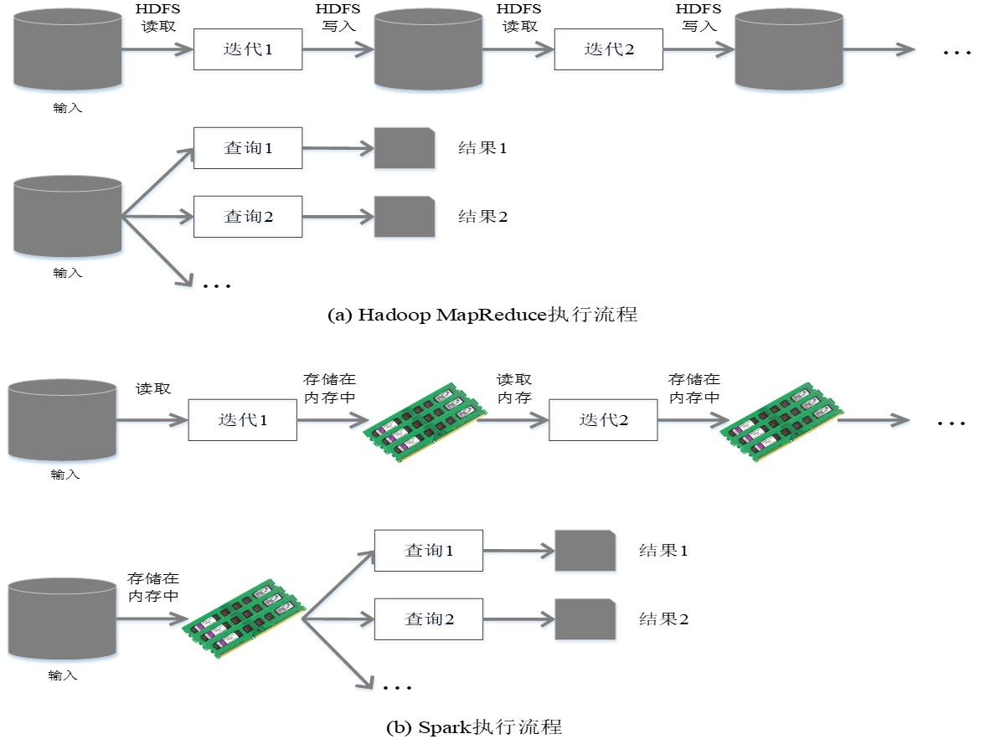

- 使用 Hadoop 进行迭代计算非常耗资源.
- Spark 将数据载入内存后, 之后的迭代计算都可以直接使用内存中的中间结果作运算,
避免了从磁盘中频繁读取数据.

## Ecosystem

- 在实际应用中, 大数据处理主要包括以下三个类型: 
    * 复杂的批量数据处理: 通常时间跨度在数十分钟到数小时之间
    * 基于历史数据的交互式查询: 通常时间跨度在数十秒到数分钟之间
    * 基于实时数据流的数据处理: 通常时间跨度在数百毫秒到数秒之间
- 当同时存在以上三种场景时, 就需要同时部署三种不同的软件, 如:
MapReduce/Impala/Storm, 可能导致如下问题: 
    * 不同场景之间输入输出数据无法做到无缝共享, 通常需要进行数据格式转换
    * 不同的软件需要不同的开发和维护团队, 带来了较高的使用成本
    * 比较难以对同一个集群中的各个系统进行统一的资源协调和分配
- Spark 的设计遵循一个软件栈满足不同应用场景的理念,
逐渐形成了一套完整的生态系统
- 既能够提供内存计算框架, 也可以支持 SQL 即时查询、实时流式计算、机器学习和图计算等
- Spark 可以部署在资源管理器 YARN 之上, 提供一站式的大数
据解决方案
- 因此, Spark 所提供的生态系统足以应对上述三种场景, 即
同时支持批处理、交互式查询和流数据处理
- Spark 生态系统已经成为伯克利数据分析软件栈BDAS(Berkeley Data
Analytics Stack)的重要组成部分, Spark 的生态系统主要包含了 Spark
Core、Spark SQL、Spark Streaming、MLLib 和 GraphX 等组件.

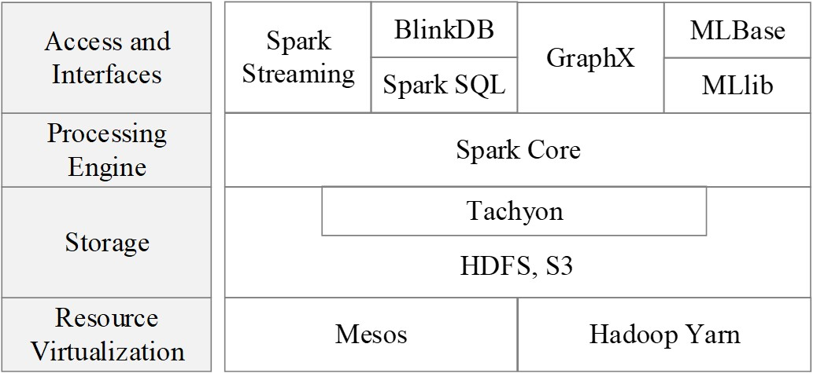

- Spark Core: 包含 Spark 最基础和最核心的功能, 如内存计算、任务调度、部
署模式、故障恢复、存储管理等, 主要面向批数据处理, 建立在统一的抽
象RDD之上
- Spark SQL: 用于结构化数据处理的组件, 允许开发人员直接处理RDD, 同也
可查询 Hive、HBase 等外部数据源.Spark SQL的一个重要特点是其能够统
一处理关系表和RDD, 使得开发人员不需要自己编写Spark应用程序, 开发
人员可以轻松地使用SQL处理命令进行查询, 并进行更复杂的数据分析.
- Spark Streaming: 流计算框架, 可以支持高吞吐量、可容错时流数据处理, 
其核心思路是将流数据分解成一系列短小的批处理作业, 每个短小的作
业都可以使用 Spark Core 进行快速处理.
Spark Streaming 支持多种数据输入源, 如Kafka、Flume和TCP套接字等.
- MLIib: 提供子常用机器学习算法的实现, 包括聚类、分类、回归, 协同过滤等.
- GraphX: Spark 中 用 于 图 计 算 的 API, 可 认 为 是 Pregel 在 Spark
上的重写及优化, GraphX性能良好, 拥有丰富的功能和运算符, 能在海量
数据上运行复杂的图算法.

Spark 生态系统组件的应用场景:

| 应用场景                 | 时间跨度     | 其他框架              | Spark 生态系统中的组件 |
|--------------------------|--------------|-----------------------|------------------------|
| 复杂的批量数据处理       | 小时级       | MapReduce、Hive       | Spark                  |
| 基于历史数据的交互式查询 | 分钟级、秒级 | Impala、Dremel、Drill | Spark SQL              |
| 基于实时数据流的数据处理 | 毫秒、秒级   | Storm、S4             | Spark Streaming        |
| 基于历史数据的数据挖掘   | -            | Mahout                | MLib                   |
| 图结构数据的处理         | -            | Pregel、Hama          | GraphX                 |

## Architecture

### 基本概念

- RDD(Resillient Distributed Dataset, 弹性分布式数据集): 分布式内存的一个抽象概念, 
提供了一种高度受限的共享内存模型.
- DAG(Directed Acyclic Graph, 有向无环图): 反映 RDD 间的依赖关系.
- Executor: 是运行在工作节点(Worker Node)的一个进程, 负责运行 Task.
- Application: 用户编写的 Spark 应用程序.
- Task: 运行在 Executor 上的工作单元.
- Job: 一个 Job 包含多个 RDD 及作用于相应 RDD 上的各种操作.
- Stage: 是 Job 的基本调度单位, 一个 Job 会分为多组 Task, 每组 Task 被称为
Stage, 或者也被称为 TaskSet , 代表了一组关联的、相互间没有 Shuffle 依赖关系的任务组成的任务集.

### 架构设计

- Spark 运行架构包括集群资源管理器(Cluster Manager) 、运行作业任务的工作节点(Worker Node)、每个应用的任务控制节点(Driver)和每个工作节点上负责具体任务的执行进程(Executor)
- 资源管理器可以自带或 Mesos 或 YARN
- 与 Hadoop MapReduce 计算框架相比, Spark 所采用的 Executor 有两个优点: 
    * 一是利用多线程来执行具体的任务, 减少任务的启动开销
    * 二是 Executor 中有一个 BlockManager 存储模块, 会将内存和磁盘共同作为存储设备, 有效减少 IO 开销.

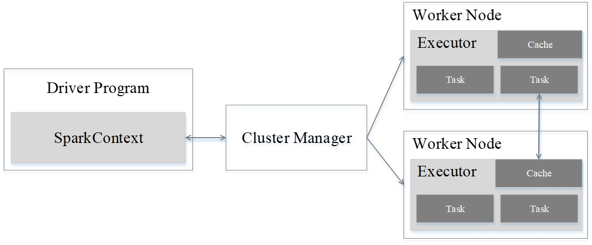

- 一个 Application 由一个 Driver 和若干个 Job 构成, 一个 Job 由多个 Stage 构成, 一个 Stage 由多个没有 Shuffle 关系的 Task 组成.
- 当执行一个 Application 时, Driver 会向集群管理器申请资源, 启动Executor, 并向 Executor 发送应用程序代码和文件, 然后在 Executor 上执行 Task, 运行结束后, 执行结果会返回给Driver, 或者写到 HDFS 或者其他数据库中.

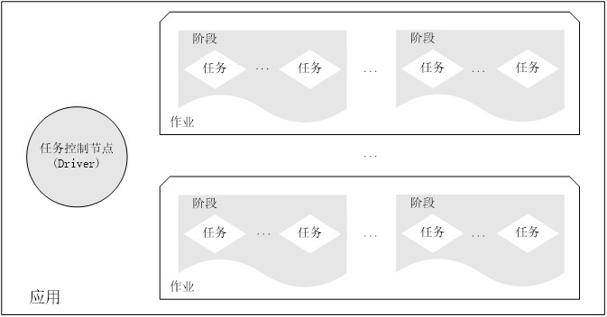

### Spark 运行基本流程

1. 首先为应用构建基本运行环境, 即由 Driver 创建一个 SparkContext, 进行资源的申请、任务分配和监控.
2. 资源管理器为 Executor 分配资源, 并启动 Executor 进程.
3. SparkContext 根据 RDD 的依赖关系构建 DAG 图 ,  DAG 图提交给 DAGScheduler 解析成 Stage, 然后把一个个 TaskSet 提交给底层调度器 TaskScheduler 处理; Executor 向 SparkContext 申请 Task, Task Scheduler 将 Task 发放给 Executor 运行, 并提供应用程序代码.
4. Task 在 Executor 上运行, 把执行结果反馈给 TaskScheduler , 然后反馈给 DAGScheduler, 运行完毕后写入数据并释放所有资源.

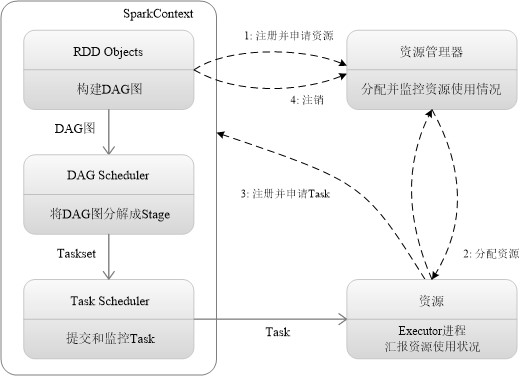

总体而言, Spark 运行架构具有以下特点:
- 每个 Application 都有自己专属的 Executor 进程, 且该进程在 Application 运行期间一直驻留.Executor 进程以多线程的方式运行 Task.
- Spark 运行过程与资源管理器无关, 只要能够获取 Executor 进程并保持通信即可.
- Executor 有 BlockManager 存储模块.
- Task 采用了数据本地性和推测执行等优化机制.

### RDD 运行原理

#### 设计背景

- 许多迭代式算法（比如机器学习、图算法等）和交互式数据挖掘工具, 共同之处是, 不同计算阶段之间会重用中间结果, 即一个阶段的输出作为下一个阶段的输入.
- 目前的 MapReduce 框架都是把中间结果写入到 HDFS 中, 带来大量的数据复制、磁盘 IO 和序列化开销.
- RDD 就是为了满足这种需求而出现的, 它提供了一个抽象的数据架构, 用户不必担心底层数据的分布式特性, 只需将具体的应用逻辑表达为一系列转换处理, 不同 RDD 之间的转换操作形成依赖关系, 可以实现管道化, 避免中间数据存储.

#### RDD 概念

- 一个 RDD 就是一个分布式对象集合, 本质上是一个只读的分区记录集合, 每个 RDD 可分成多个分区, 每个分区就是一个数据集片段, 且一个 RDD 的不同分区可以被保存到集群中不同的节点上, 从而可以在集群中的不同节点上进行并行计算.
- RDD 提供了一种高度受限的共享内存模型, 即 RDD是只读的记录分区的集合, 不能直接修改, 只能基于稳定的物理存储中的数据集创建 RDD, 或通过在其他 RDD 上执行确定的转换操作（如map、join和group by）而创建得到新的 RDD.
- RDD 提供了一组丰富的操作以支持常见的数据运算, 分为动作(Action)和转换(Transformation)两种类型.
- RDD 提供的转换接口都非常简单, 都是类似 map、filter、groupBy、join 等粗粒度的数据转换操作, 而不是针对某个数据项的细粒度修改(不适合网页爬虫), 接受 RDD, 输出 RDD.
- RDD 的动作接口, 如 count, collect, 接受 RDD, 输出非 RDD.
- 表面上 RDD 的功能很受限、不够强大, 实际上 RDD 已经被实践证明可以高效地表达许多框架的编程模型(比如MapReduce、SQL、Pregel).
- Spark 用 Scala 语言实现了 RDD 的 API, 程序员可以通过调用 API 实现对 RDD 的各种操作.

RDD 典型的执行过程如下:
1. RDD 读入外部数据源进行创建.
2. RDD 经过一系列的转换（transformation）操作, 每一次都会产生不同的 RDD, 供给下一个转换操作使用.
3. 最后一个 RDD 经过动作(action)操作进行转换, 并输出到外部数据源.

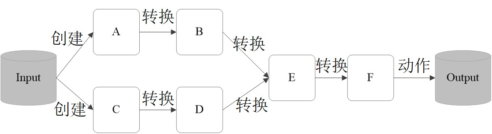

这一系列处理称为一个 Lineage（血缘关系）, 即 DAG 拓扑排序的结果.

- 优点: 惰性调用、管道化、避免同步等待、不需要保存中间结果、每次操作变得简单.
- 惰性调用: 对于 transformation, 只记录 RDD 间的生成与依赖关系, 只在执行 action 时, 才触发真正的计算.
- 管道化: 一个操作得到的结果, 无需中间存储, 直接管道式流转到下一个操作.

#### RDD 特性

- Spark 采用 RDD 以后能够实现高效计算的原因主要在于高效的容错性:
    * 现有容错机制: 数据复制或者记录日志
    * RDD: 血缘关系、通过血缘关系重新计算丢失分区实现容错、无需回滚系统、重算过程可在不同节点之间并行、只记录粗粒度的操作.
- 分布式数据集的容错性有两种方式: 即数据检查点和记录数据的更新.
    * 数据检查点方式: 代价很高, 需要通过数据中心的网络连接在机器之间复制庞大的数据集, 而网络带宽往往比内存带宽低得多, 同时还需要消耗更多的存储资源（在内存中复制数据可以减少需要缓存的数据量, 而存储到磁盘则会拖慢应用程序）.所以选择记录更新的方式.
    * 记录更新方式: 更新太多, 记录更新代价也不低.因此 RDD 只支持读操作, 且只支持粗粒度转换, 即在大量记录上执行的单个操作.将创建 RDD 的一系列转换记录下来(即 Lineage) , 以便恢复丢失的分区.
- 虽然只支持粗粒度转换限制了编程模型, 但 RDD 仍可以很好地适用于很多应用, 特别是支持数据并行的批量分析应用, 包括数据挖掘、机器学习、图算法等, 因为这些程序通常都会在很多记录上执行相同的操作.
- 中间结果持久化到内存, 数据在内存中的多个 RDD 操作间进行传递, 避免了不必要的读写磁盘开销.
- 存放的数据可以是 Java 对象, 避免了不必要的对象序列化和反序列化.

#### RDD 间的依赖关系

##### Shuffle 操作

一个关于Shuffle 操作的简单实例 reduceByKey: 需要把与某个 key 关 联的所有 value 都发送到同一台机器上, 涉及数据的重新分发, 带来高昂的网络传输开销.

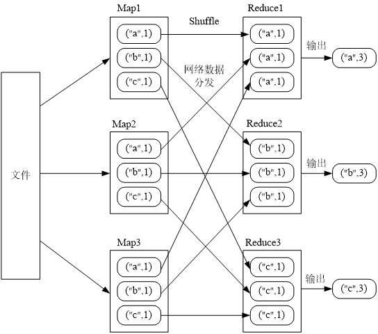

##### 窄依赖和宽依赖

是否包含 Shuffle 操作是区分窄依赖和宽依赖的根据.

- 窄依赖表现为一个父 RDD 的分区对应于一个子 RDD 的分区, 或多个父 RDD 的分区对应于一个子 RDD 的分区.
- 宽依赖则表现为存在一个父 RDD 的一个分区对应一个子 RDD 的多个分区.

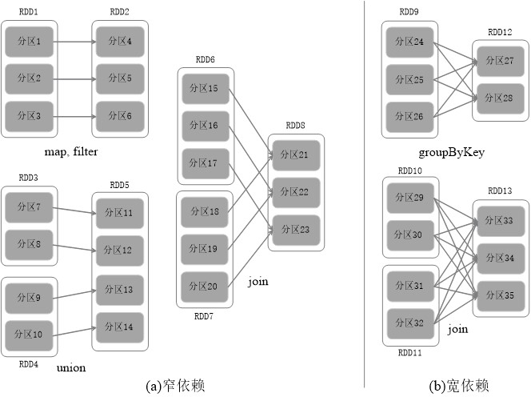

#### Stage 的划分

Spark 根据 DAG 图中的 RDD 依赖关系, 把一个作业分成多个阶段.阶段划分的依据是窄依赖和宽依赖.对于宽依赖和窄依赖而言, 窄依赖对于作业的优化很有利, 宽依赖无法优化.在逻辑上, 每个 RDD 操作都是一个 fork/join（一种用于并行执行任务的框架）, 把计算 fork 到每个 RDD 分区, 完成计算后对各个分区得到的结果进行 join 操作, 然后 fork/join 下一个 RDD 操作.

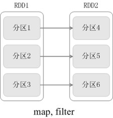

fork/join 的优化原理:

举例: 一个学校（含2个班级）完成从北京到厦门的长征:
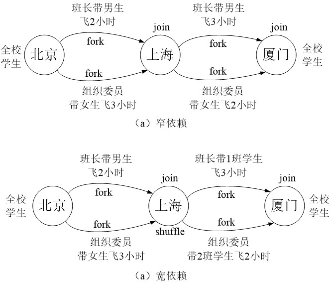

窄依赖可以实现流水线优化, 宽依赖无法实现流水线优化.

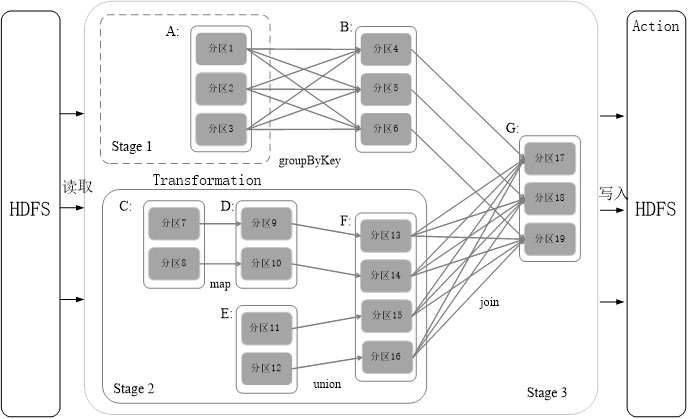

- Spark 根据 DAG 图中的 RDD 依赖关系, 把一个作业分成多个阶段.窄依赖可以实现流水线优化, 宽依赖包含Shuffle过程, 无法实现流水线方式处理.
- Spark 通过分析各个 RDD 的依赖关系生成了 DAG, 再通过分析各个 RDD
中的分区之间的依赖关系来决定如何划分 Stage, 具体划分方法是: 
    * 在 DAG 中进行反向解析, 遇到宽依赖就断开
    * 遇到窄依赖就把当前的 RDD 加入到 Stage 中
    * 将窄依赖尽量划分在同一个 Stage 中, 可以实现流水线计算
- 分成三个 Stage, 在 Stage 2 中, 从 map 到 union 都是窄依赖, 这两步操作可以形成一个流水线操作.
- e.g. 分区 7 通过 map 操作生成的分区 9, 可以不用等待分区 8 到分区 10 这个 map 操作的计算结束, 而是继续进行 union 操作, 得到分区 13, 这样流水线执行大大提高了计算的效率.

Stage 的类型包括两种: ShuffleMapStage 和 ResultStage, 具体如下: 
- ShuffleMapStage: 不是最终的Stage, 在它之后还有其他Stage, 所以, 它的输出一定需要经过 Shuffle 过程, 并作为后续 Stage 的输入；这种 Stage 是以 Shuffle 为输出边界, 其输入边界可以是从外部获取数据, 也可以是另一个 ShuffleMapStage 的输出, 其输出可以是另一个 Stage 的开始；在一个 Job 里可能有该类型的 Stage, 也可能没有该类型 Stage.
- ResultStage: 最终的Stage, 没有输出, 而是直接产生结果或存储.这种 Stage 是直接输出结果, 其输入边界可以是从外部获取数据, 也可以是另一个 ShuffleMapStage 的输出.在一个 Job 里必定有该类型 Stage.
- 一个 Job 含有一个或多个 Stage, 其中至少含有一个 ResultStage.

#### RDD 运行过程

1. 创建 RDD 对象.
2. SparkContext 负责计算 RDD 之间的依赖关系, 构建 DAG.
3. DAGScheduler 负责把 DAG 分解成多个 Stage, 每个 Stage 中包含了多个 Task, 每个 Task 会被 TaskScheduler 分发给各个 Worker Node 上的 Executor 去执行.

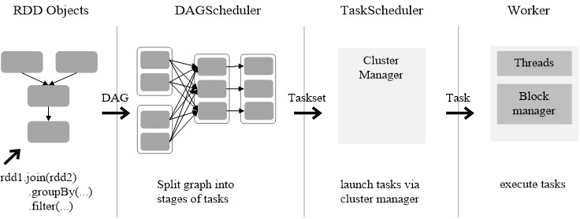

## Spark SQL
 
## 部署和应用方式

## Demo
